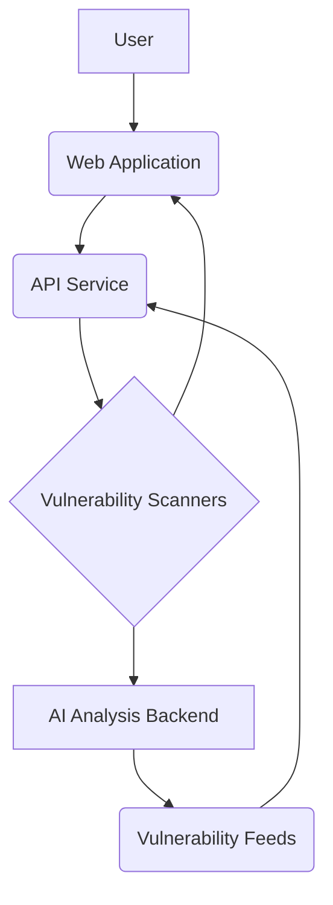

# 🛡️ OpenSentinel

**OpenSentinel** is a powerful, fully free and open-source web-based pentesting platform. Designed for ethical hackers, developers, and security enthusiasts, it automates advanced scanning, vulnerability detection, and report generation using a hybrid of open-source tools and modern cloud integrations.

---

## 🚀 Features

* 🌐 Web UI (Next.js frontend)
* ⚙️ Node.js/Express API backend
* 🧠 AI-assisted reports via Google Gemini (free tier)
* 🔍 Advanced scanning with:

  * `nmap`
  * `OWASP ZAP`
  * `OSV.dev` API for CVE lookups
  * Optional: `Nikto`, `SQLMap`, `Wapiti`
* 🧪 Fuzzing and anomaly detection (custom plugin support)
* 🗃️ MongoDB for scan data
* 🔐 Supabase (self-hosted) for auth and metadata
* 🔄 Job Queue system using Redis + BullMQ
* 📦 Lightweight with Alpine-based Docker images
* 📊 Optional integration with Grafana, Loki, ELK

---

## ��️ Architecture



---

## 🐳 Docker Setup

### API (`./api/Dockerfile`)

```dockerfile
FROM node:20-alpine
WORKDIR /app
COPY package.json package-lock.json ./
RUN npm ci --only=production
COPY . .
EXPOSE 4000
CMD ["node", "dist/index.js"]
```

### Scanner Service (`./scanner/Dockerfile`)

```dockerfile
FROM python:3.11-alpine
WORKDIR /app
COPY requirements.txt ./
RUN pip install --no-cache-dir -r requirements.txt
COPY . .
EXPOSE 8001
CMD ["uvicorn", "scanner_service:app", "--host", "0.0.0.0", "--port", "8001"]
```

---

## 🧠 AI Integration

* Uses Google Gemini (via remote API)
* Free-tier enabled (auto summarization, CVSS scoring)
* Rate-limited and quota-friendly

---

## ☁️ Deployments

### Vercel (Frontend only)

`vercel.json`

```json
{
  "version": 2,
  "builds": [
    { "src": "next.config.js", "use": "@vercel/next" }
  ],
  "routes": [
    { "src": "/api/(.*)", "dest": "/api/$1" },
    { "src": "/(.*)", "dest": "/index.html" }
  ]
}
```

### Fly.io (Backend)

`fly.toml`

```toml
app = "opensentinel"
[build]
  image = "your-image-name:latest"
[env]
  NODE_ENV = "production"
[http_service]
  internal_port = 4000
  force_https = true
  auto_stop_machines = true
  auto_start_machines = true
  min_machines_running = 1
  processes = ["app"]
```

---

## 🧪 Plugin System (Coming Soon)

Drop-in scanner plugins:

* Python or Bash based
* Auto-discovery via manifest (`plugin.yaml`)
* Enable your own tools like `ffuf`, `nuclei`, `custom payload scripts`

---

## 📦 Requirements

* Docker & Docker Compose
* Free-tier Google API key for Gemini
* GitHub account for CI/CD (optional)
* Redis (for queue)
* MongoDB Atlas or self-hosted
* Supabase (can self-host or use free tier)

---

## 🛡️ Security & Hardening

* LLM API rate limiting
* Auth via Supabase + JWT
* Dependency scanning via `npm audit`, `pip-audit`, `trivy`
* Sandbox OWASP ZAP and others via Docker

---

## 💡 Roadmap

* [ ] Auto-scan scheduling
* [ ] Multi-user dashboards
* [ ] PDF report export
* [ ] CVE database mirror
* [ ] AI-assisted remediation suggestions

---

## 📜 License

OpenSentinel is licensed under the MIT License. Contributions welcome!

---

## 🤝 Contributing

1. Fork the repo
2. Create a feature branch
3. Submit a PR
4. ⭐ Star the project if you find it useful!

---

## ✨ Name Meaning

> **OpenSentinel** = Open-source + Sentinel (a watcher/guardian)

Keeping your services secure — one scan at a time.

---

## 📫 Contact

* GitHub Issues for bugs/feature requests
* Discord/Matrix/IRC (coming soon!)

---

Let me know if you'd like this turned into a working repo template with CI/CD integration!

---

## 🅰️ Alpha Release: Web VA & AI Core

**Goal:** Deliver a minimal containerized platform for web-app vulnerability assessment with AI-assisted reporting.

### 1. Core Web-VA Tool Suite

*   **Subdomain Enumeration**
    *   Install and configure `subfinder` v2.5.3 for passive DNS and certificate scraping.
    *   Integrate `amass` v3.21.0 for active network enumeration with recursive brute-forcing of subdomains.
*   **HTTP Probing & Discovery**
    *   Use `httpx` v1.2.0 for fast HTTP probing (status codes, TLS details, titles).
    *   Incorporate `waybackurls` v0.0.7 to pull previously archived endpoints from the Wayback Machine.
*   **WAF Detection**
    *   Deploy `wafw00f` v2.1.0 to identify web application firewalls and adapt scanning techniques.
*   **Directory & Content Fuzzing**
    *   Configure `dirsearch` v0.4.1 with custom wordlists for common and hidden directories.
    *   Set up `gobuster` v4.0.1 for fast directory enumeration with both directory and DNS modes.
    *   Integrate `wfuzz` v3.1.0 for parameter fuzzing, XSS, and SQLi injection point discovery.
*   **Automated Vulnerability Scanning**
    *   Use `nikto` v2.1.6 for server misconfigurations and outdated components.
    *   Run `whatweb` v1.4.4 for technology fingerprinting and plugin-based analysis.
    *   Integrate `nuclei` v2.8.5 with a curated set of templates (OWASP, core, community).
    *   Deploy OWASP `zaproxy` v2.13.0 in headless mode for comprehensive Active Scan rulesets.
*   **Optional Deep Scanning**
    *   Include `wapiti` v4.6.1 for black-box testing of SQLi, XSS, RFI, SSRF.
    *   Add `skipfish` v2.10b for a fast heuristic-based crawler scan.

### 2. AI-Powered Analysis Backend

*   **Flask Service**
    *   Create a Python 3.10 Flask application with a single `/analyze` POST endpoint.
    *   Validate incoming JSON schema using `pydantic` v1.10.
*   **Model Integration**
    *   Primary: Google Gemini Pro via `google-generativeai` v1.0.0 (free tier).
    *   Fallback: OpenRouter.ai (GPT-3.5) and Together.ai (Mixtral) with automatic retry logic.
*   **Input/Output Specification**
    *   Input payload:
        ```json
        {
          "scan_results": [...],
          "cve_data": [...],
          "epss_data": [...],
          "kev_data": []
        }
        ```
    *   Output payload:
        ```json
        {
          "summary": "Consolidated vulnerability overview...",
          "ratings": { "CVE-2023-1234": 5, ... },
          "remediation": ["Update X to version Y","Implement WAF rule Z"]
        }
        ```
*   **Error Handling & Logging**
    *   Return HTTP 4xx for invalid inputs; 5xx for AI/service errors.
    *   Structured JSON logs with correlation IDs.

### 3. Vulnerability Feeds Integration

*   **CVE & NVD Feeds**
    *   Scheduled daily fetch of NIST NVD JSON feeds (e.g., `nvdcve-1.1-modified.json`).
    *   Parse and store only web-app related CVEs (HTTP, web frameworks) in `/data/feeds/cve/`.
*   **EPSS Scores**
    *   Download `epss_scores-YYYY-MM-DD.csv.gz` and extract scores.
    *   Filter and tag CVEs with EPSS > 0.75 as "High Priority".
*   **CISA KEV Catalog**
    *   Fetch CISA KEV CSV weekly and mark any matching CVEs as "Known-Exploited."

### 4. Basic Docker & Compose Setup

*   **Dockerfile (Debian Bookworm Slim)**
    *   Install all tools, Python 3.10, pip, Flask, `google-generativeai`, `pydantic`, `requests`.
    *   Add a startup script `entrypoint.sh` to update feeds and launch Flask.
    *   ENV: `GEMINI_API_KEY`, `OPENROUTER_API_KEY`, `TOGETHERAI_API_KEY`.
    *   Expose port `3000` and set `CMD ["/entrypoint.sh"]`.
*   **docker-compose.yml**
    *   Service `webapp` builds from Dockerfile.
    *   Volumes: `scans_data:/data/scans`, `feeds_data:/data/feeds`.
    *   Environment from `.env` file.
    *   Healthcheck: `curl --fail http://localhost:3000/health || exit 1`.

### 5. Documentation & Tests

*   **README.md** with:
    *   Architecture diagram (Mermaid or ASCII).
    *   Setup instructions (Docker, .env, Ignition for CoreOS).
*   **Examples**
    *   Provide sample scan JSONs in `examples/`.
*   **Testing**
    *   Unit tests using `pytest` for analyzer logic.
    *   Integration test: run Nuclei against `vulnerables.me` demo and assert returned summary contains expected keywords.

---

## 🅱️ Beta Release: Enhanced Scanning, Reporting & Hardening

**Goal:** Build on Alpha by expanding tool coverage, adding UI, observability, and tightening security.

### 1. Expanded Tool Suite

*   Add advanced scanners: `w3af` v1.7.3, `arachni` v1.5.1, `vega` v1.1.0.
*   Integrate custom `nuclei` templates for CVE-2023 series.
*   Include `dnsrecon` and `subjack` for certificate and subdomain takeover checks.

### 2. Reporting Dashboard

*   Build a lightweight React frontend using Tailwind CSS.
*   Integrate `/docs` OpenAPI UI via Swagger-UI.
*   Dashboard features: scan history, filter by rating, detailed CVE view, export to CSV/PDF.

### 3. Logging & Monitoring

*   Configure ELK stack or Grafana Loki for log aggregation.
*   Expose Prometheus metrics (`/metrics`) for scan count, durations, AI latency.
*   Setup Alertmanager for notifying Slack/Email on failures or >10 Critical ratings.

### 4. CI/CD & Compliance

*   GitHub Actions workflows:
    *   `build-test-deploy`: build Docker, run tests, push to Docker Hub.
    *   `scheduled-scan`: daily run of scan pipeline, upload JSON artifact.
    *   `feed-updater`: weekly feed refresh.
*   Integrate Trivy scan in CI; fail build on high-severity findings.
*   Use Licensee to ensure all dependencies are MIT/Apache.

### 5. Security Hardenings

*   Drop root user: create `opensentinel` user in Dockerfile.
*   Mount code as read-only; scan results writeable only to `/data/scans`.
*   Front requests rate-limited via Nginx sidecar.

---

## 🔢 v1.0 Release: Production Scale & Extensibility

**Goal:** Finalize for production with multi-tenancy, plugin ecosystem, and robust developer/deployment experience.

### 1. Resilience & Scaling

*   Architect as microservices:
    *   `api` service (Flask)
    *   `worker` service (Celery + RabbitMQ)
    *   `ui` service (React)
*   Horizontal scaling: run multiple `worker` replicas via Docker Compose or Kubernetes.

### 2. Multi-Tenancy & RBAC

*   Design database schema with `tenant_id` on all tables.
*   Implement OAuth2 authentication via Keycloak or Auth0.
*   Define roles: `admin`, `team_member`, `viewer` with granular endpoint permissions.

### 3. Backup & Restore

*   Write backup script to snapshot `/data/scans` and `/data/feeds` to S3 (AWS CLI).
*   CLI command `opensentinel restore --from s3://bucket/path`.

### 4. API & Developer Experience

*   Auto-generate OpenAPI spec and serve via `/docs`.
*   Provide VSCode devcontainer config with Docker Compose support.
*   Makefile targets: `make build`, `make scan`, `make analyze`, `make test`, `make deploy`.

### 5. Internationalization & Localization

*   Use `Flask-Babel` for server-side translations.
*   Extract frontend strings into JSON resource files for translation.
*   Offer language switcher in UI.
